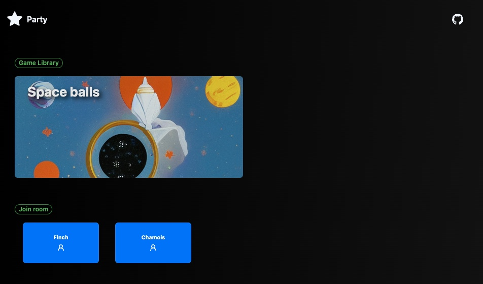
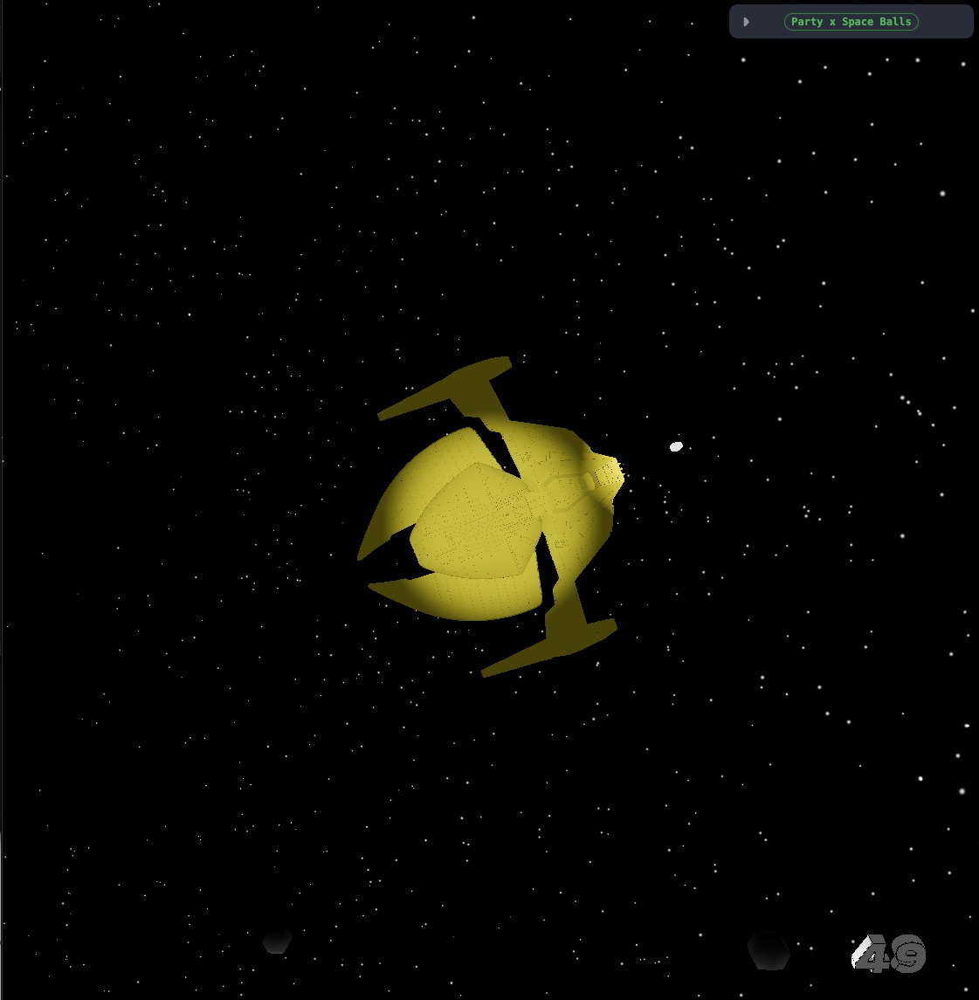
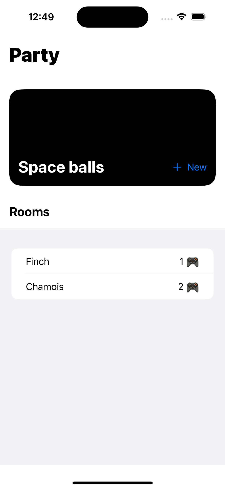

# Party games

## What I want to explore

- Monorepo with turborepo
- Three JS
- Node JS based server
- Socket.io
- Docker
- Azure ACI
- Github Workflow
- [Bun](https://bun.sh/) => Faster for nextjs, but doesn't support some web socket modules

## What's inside?

This turborepo uses [npm](https://www.npmjs.com/) as a package manager. It includes the following packages/apps:

### Apps and Packages

- `api`: a [Fastify](https://www.fastify.io/) server with [Socket.IO](https://socket.io/)
- `games`: a [Next.js](https://nextjs.org) app
- `interface`: utility interface shared by `games` and `api` applications
- `eslint-config-custom`: `eslint` configurations (includes `eslint-config-next` and `eslint-config-prettier`)
- `tsconfig`: `tsconfig.json`s used throughout the monorepo

Each package/app is 100% [TypeScript](https://www.typescriptlang.org/).

### Build

To build all apps and packages, run the following command:

```
cd party
yarn build
```

### Develop

To develop all apps and packages, run the following command:

```
cd party
yarn dev
```

### Docker

This repo is configured to be built with Docker, and Docker compose. To build all apps in this repo:

```
# Create a network, which allows containers to communicate
# with each other, by using their container name as a hostname
docker network create app_network

# Build prod using new BuildKit engine
DOCKER_BUILDKIT=1 docker-compose -f docker-compose.yml build --parallel

# Alternatively, build each app separately from root context
docker build -f apps/games/Dockerfile .
docker build -f apps/api/Dockerfile .

# Start prod in detached mode
docker-compose -f docker-compose.yml up -d
```

Open http://localhost:3000.
Open http://localhost:8080.

To shutdown all running containers:

```
# Stop all running containers
docker kill $(docker ps -q) && docker rm $(docker ps -a -q)
```

## Azure deployment using ACI

https://learn.microsoft.com/en-us/azure/container-instances/tutorial-docker-compose

```shell
az login
az group create --name myResourceGroup --location eastus
az acr create --resource-group myResourceGroup --name ghoshanjega --sku Basic
az acr login --name ghoshanjega

DOCKER_BUILDKIT=1 docker-compose -f docker-compose.yml build --parallel
docker-compose push

docker login azure

docker context create aci partycontext
docker context use partycontext

docker-compose -f docker-compose.yml up -d
```

## Fly deployment

```
fly deploy --config fly.games.toml
fly deploy --config fly.api.toml

```

## Web UI




## Apple UI


